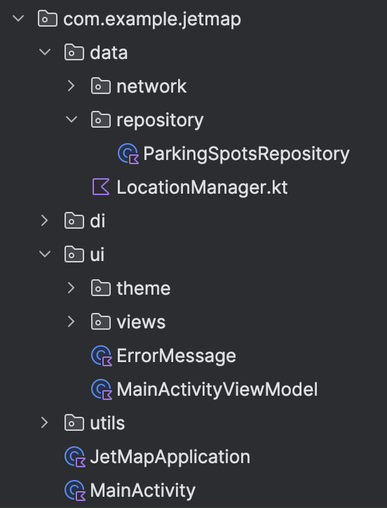
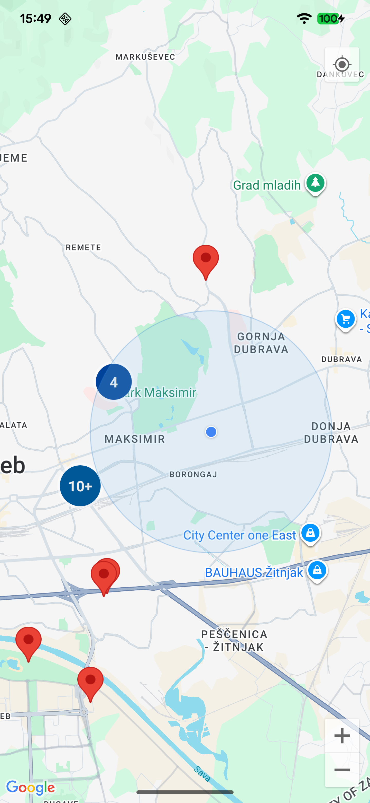
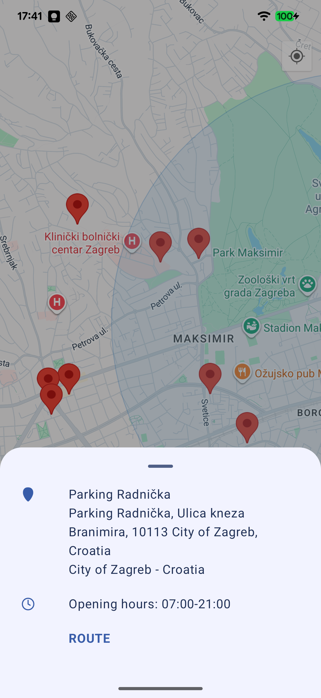
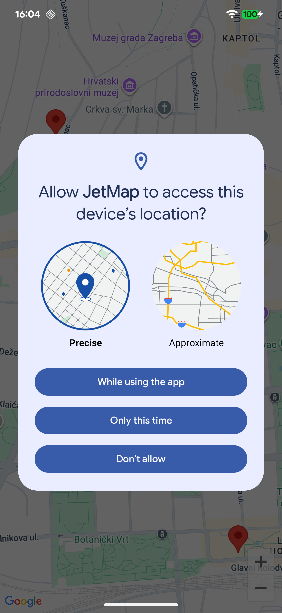
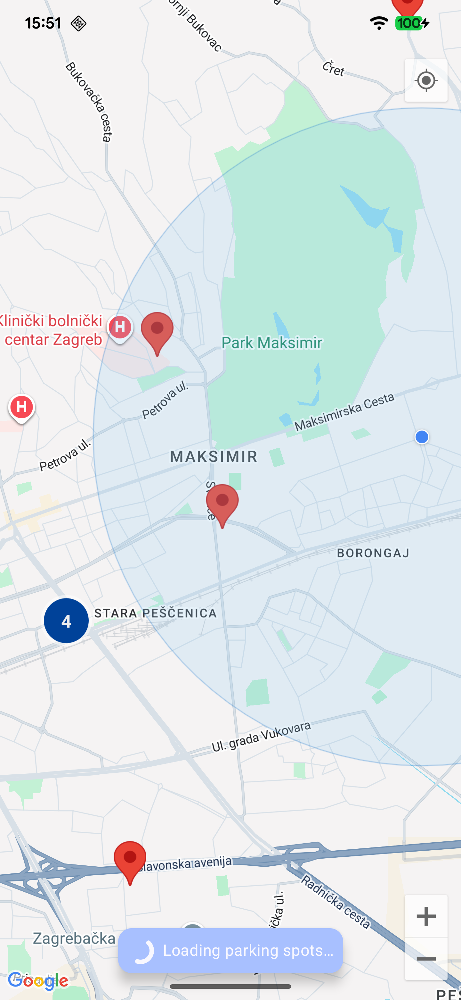

# JetMap - Parking Spot Finder

A modern Android app built with Jetpack Compose that helps users find nearby parking spots using Google Maps integration.

## 🎯 Current Status: Demo Project

This is a **demo project**, not production-ready code.

## 📱 Features

- **Interactive Google Maps** - Smooth zoom, pan, and clustering
- **Location-Based Search** - Find parking spots near your current location
- **Real-Time Data** - Live parking information from Geoapify API
- **Modern UI** - Material Design 3 with Jetpack Compose
- **Smart Clustering** - Efficiently display multiple parking spots
- **Detailed Information** - View opening hours and parking details
- **Navigation Integration** - Get directions to selected spots
- **Permission Handling** - User-friendly location permission flow

## 🛠️ Tech Stack

### Core Technologies
- **Android SDK** - API 26+ (Android 8.0+)
- **Kotlin** - 2.2.20
- **Jetpack Compose** - Modern declarative UI
- **Material 3** - Latest design system

### Key Libraries
- **Hilt** - Dependency injection
- **Retrofit** - HTTP client for API calls
- **Moshi** - JSON serialization
- **Google Maps Compose** - Maps integration
- **Coroutines** - Asynchronous programming
- **Accompanist Permissions** - Permission handling

## 🏗️ Architecture

This project follows **Clean Architecture** principles:

- **MVVM Pattern** - ViewModels with StateFlow for reactive UI
- **Repository Pattern** - Clean data layer abstraction
- **Dependency Injection** - Hilt for managing dependencies
- **Sealed Classes** - Type-safe error handling with `NetworkResult`
- **Coroutines** - Asynchronous programming with Flow

## 📁 Project Structure

## 📋 Setup Instructions

### Prerequisites
- Android Studio Hedgehog (2023.1.1) or later
- Android SDK 26+
- Google Maps API key
- Geoapify API key

### Installation
1. Clone the repository
2. Copy `secrets.properties.example` to `secrets.properties`
3. Replace placeholder API keys with your actual keys:
    - Get Google Maps API key from [Google Cloud Console](https://console.cloud.google.com/)
    - Get Geoapify API key from [Geoapify](https://www.geoapify.com/)
4. Build and run the project

⚠️ **Never commit `secrets.properties` to version control**

## 🚀 Production Readiness Roadmap

- [ ] Comprehensive unit tests
- [ ] Integration tests
- [ ] ProGuard configuration
- [ ] Offline data caching
- [ ] Security improvements (API key management)
- [ ] Crash reporting (Firebase Crashlytics)
- [ ] Performance monitoring
- [ ] Code documentation
- [ ] CI/CD pipeline

## 📸 Screenshots

| Map View                              | Parking Spot Details                                     |
|---------------------------------------|----------------------------------------------------------|
|  |  |

| Location Permissions                                 | Loading State                             |
|------------------------------------------------------|-------------------------------------------|
|  |  |

## 🙏 Acknowledgments

- [Google Maps Platform](https://developers.google.com/maps) for mapping services
- [Geoapify](https://www.geoapify.com/) for parking spot data
- [Material Design](https://material.io/) for design guidelines
- [Jetpack Compose](https://developer.android.com/jetpack/compose) for modern UI toolkit
- [Car parking icons created by mavadee - Flaticon](https://www.flaticon.com/free-icons/car-parking)

## 👨‍💻 Author

**Kristina Knežević**
- LinkedIn: [LinkedIn Profile](https://www.linkedin.com/in/kristina-kne%C5%BEevi%C4%87/)

## 📄 License

This project is licensed under the MIT License - see the [LICENSE](LICENSE) file for details.